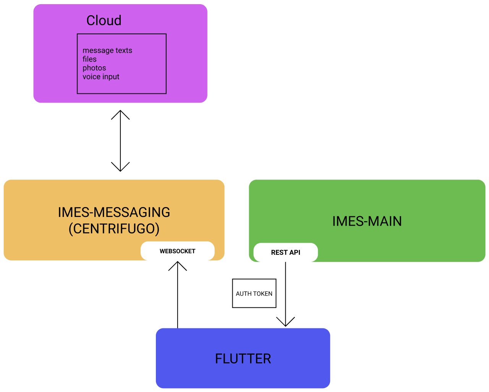

# IMES
## BACKEND

Backend представлен HTTP REST API и websocket

[https://www.figma.com/file/hItQHEsFvnJsw0og6jMSfB/Flow-Chart-(Copy)?node-id=59411%3A0](https://www.figma.com/file/hItQHEsFvnJsw0og6jMSfB/Flow-Chart-(Copy)?node-id=59411%3A0)

## REST API IMES-MAIN

[Click to import IMES API Isomnia file](files/IMES-API.json)

IMES-MAIN апи охватывает почти весь основной функционал приложения, IMES-MESSAGING предназначен только для доставки сообщений между пользователеми платформы

